# Modelo de Dados - Financeiro API

**Versão:** 1.0.0
**Última Atualização:** 2024-11-30
**Banco de Dados:** PostgreSQL 14+

## Sumário

1. [Visão Geral](#visão-geral)
2. [Diagrama ER (Mermaid)](#diagrama-er)
3. [Entidades Principais](#entidades-principais)
4. [Entidades de Suporte](#entidades-de-suporte)
5. [Relacionamentos](#relacionamentos)
6. [Índices e Performance](#índices-e-performance)
7. [Criptografia de Dados](#criptografia-de-dados)
8. [Soft Delete](#soft-delete)

---

## Visão Geral

O sistema utiliza uma arquitetura multi-tenant onde cada empresa (tenant) possui isolamento completo de dados. As principais áreas funcionais são:

- **Gestão Empresarial**: Empresas, usuários, perfis de acesso
- **Financeiro**: Contas a pagar, contas a receber, baixas
- **Bancário**: Contas bancárias, movimentações, conciliação
- **Contabilidade**: Plano de contas, DRE
- **Auditoria**: Logs imutáveis de todas as operações

---

## Diagrama ER

```mermaid
erDiagram
    %% ===== GESTÃO EMPRESARIAL =====
    EMPRESA {
        uuid id PK
        uuid sede_id FK "Matriz (auto-referência)"
        string cliente_id "Multi-tenancy"
        string razao_social
        string nome_fantasia
        string cnpj_cpf UK
        string inscricao_estadual
        string inscricao_municipal
        string cep
        string logradouro
        string numero
        string bairro
        string complemento
        string cidade
        string uf
        string telefone
        string email
        date data_abertura
        boolean ativo
        timestamp deletado_em
    }

    USUARIO {
        uuid id PK
        string nome
        string cargo
        string login UK
        string senha "Criptografada"
        string telefone
        string email
        boolean ativo
        timestamp criado_em
        timestamp atualizado_em
        timestamp deletado_em
    }

    PERFIL {
        uuid id PK
        string cliente_id
        string nome
        jsonb permissoes "Estrutura de permissões"
        boolean ativo
        timestamp deletado_em
    }

    USUARIO_EMPRESA_FILIAL {
        uuid id PK
        uuid usuario_id FK
        uuid empresa_id FK
        uuid filial_id FK
        timestamp criado_em
    }

    USUARIO_PERFIL {
        uuid id PK
        uuid usuario_id FK
        uuid perfil_id FK
    }

    %% ===== CADASTROS BASE =====
    PESSOA {
        uuid id PK
        string cliente_id
        uuid empresa_id FK
        uuid filial_id FK
        uuid endereco_id FK
        string razao_nome
        string fantasia_apelido
        string documento "CPF/CNPJ"
        string ie_rg
        string im
        enum tipo_contribuinte
        boolean consumidor_final
        date aniversario
        decimal limite_credito
        enum situacao_financeira "ATIVO, INATIVO, BLOQUEADO, SUSPENSO"
        string email
        string telefone
        enum situacao
        boolean ativo
        timestamp deletado_em
    }

    PESSOA_TIPO {
        uuid id PK
        uuid pessoa_id FK
        string tipo "cliente, fornecedor, transportadora, etc"
    }

    ENDERECO {
        uuid id PK
        string cep
        string logradouro
        string numero
        string complemento
        string bairro
        uuid cidade_id FK
    }

    CIDADE {
        uuid id PK
        string nome
        string uf
        string codigo_ibge
    }

    %% ===== PLANO DE CONTAS =====
    PLANO_CONTAS {
        uuid id PK
        uuid empresa_id FK
        uuid parent_id FK "Auto-referência hierárquica"
        string codigo UK
        string descricao
        string tipo "Receita, Custo, Despesa, Outros"
        int nivel
        boolean permite_lancamento
        boolean ativo
        timestamp deletado_em
    }

    %% ===== CONTAS BANCÁRIAS =====
    CONTAS_BANCARIAS {
        uuid id PK
        string cliente_id
        uuid empresa_id FK
        string banco "Criptografado"
        string agencia "Criptografado"
        string agencia_digito "Criptografado"
        string conta "Criptografado"
        string conta_digito "Criptografado"
        string descricao
        string tipo
        decimal saldo_inicial "Criptografado"
        decimal saldo_atual "Criptografado"
        date data_referencia_saldo
        boolean ativo
        timestamp deletado_em
    }

    %% ===== CONTAS A PAGAR =====
    CONTAS_PAGAR {
        uuid id PK
        uuid pessoa_id FK
        uuid plano_contas_id FK
        uuid empresa_id FK
        string documento
        string serie
        int parcela
        string tipo "Fornecedor, Empréstimo, etc"
        string descricao
        date data_emissao
        date vencimento
        date data_lancamento
        date data_liquidacao
        decimal valor_principal "Criptografado"
        decimal acrescimos "Criptografado"
        decimal descontos "Criptografado"
        decimal valor_total "Criptografado"
        decimal saldo "Criptografado"
        string status "Pendente, Vencida, Paga, Parcialmente Paga"
        timestamp cancelado_em
        text justificativa_cancelamento
        timestamp deletado_em
    }

    %% ===== CONTAS A RECEBER =====
    CONTAS_RECEBER {
        uuid id PK
        uuid pessoa_id FK
        uuid plano_contas_id FK
        uuid empresa_id FK
        string documento
        string serie
        int parcela
        enum tipo "BOLETO, PIX, CARTAO, etc"
        string descricao
        date data_emissao
        date vencimento
        date data_lancamento
        date data_liquidacao
        decimal valor_principal "Criptografado"
        decimal valor_acrescimos "Criptografado"
        decimal valor_descontos "Criptografado"
        decimal valor_total "Criptografado"
        decimal saldo "Criptografado"
        enum status "PENDENTE, PARCIAL, LIQUIDADO, CANCELADO, VENCIDO"
        timestamp deletado_em
    }

    %% ===== BAIXAS (LIQUIDAÇÕES) =====
    BAIXAS_PAGAMENTO {
        uuid id PK
        uuid conta_pagar_id FK
        uuid conta_bancaria_id FK
        uuid movimentacao_bancaria_id FK
        date data
        decimal valor "Criptografado"
        decimal acrescimos "Criptografado"
        decimal descontos "Criptografado"
        decimal total "Criptografado"
        string tipo "Parcial, Total"
        text observacao
        decimal saldo_anterior "Criptografado"
        decimal saldo_posterior "Criptografado"
        uuid criado_por_id FK
        timestamp deletado_em
    }

    BAIXAS_RECEBIMENTO {
        uuid id PK
        uuid conta_receber_id FK
        uuid conta_bancaria_id FK
        uuid movimentacao_bancaria_id FK
        date data
        decimal valor "Criptografado"
        decimal acrescimos "Criptografado"
        decimal descontos "Criptografado"
        decimal total "Criptografado"
        enum tipo "PARCIAL, TOTAL"
        text observacao
        decimal saldo_anterior "Criptografado"
        decimal saldo_posterior "Criptografado"
        uuid criado_por_id FK
        timestamp deletado_em
    }

    %% ===== MOVIMENTAÇÕES BANCÁRIAS =====
    MOVIMENTACOES_BANCARIAS {
        uuid id PK
        uuid conta_bancaria_id FK
        uuid empresa_id FK
        uuid plano_contas_id FK
        date data_movimento
        string descricao
        string conta
        string categoria
        decimal valor "Criptografado"
        string tipo_movimento "Crédito, Débito"
        text observacao
        char conciliado "S/N"
        timestamp conciliado_em
        uuid conciliado_por FK
        string referencia "Pagar, Receber, Manual"
        timestamp deletado_em
    }

    %% ===== EXTRATO BANCÁRIO =====
    EXTRATOS_BANCARIOS {
        uuid id PK
        uuid conta_bancaria_id FK
        uuid empresa_id FK
        uuid movimentacao_sugerida_id FK
        uuid movimentacao_conciliada_id FK
        date data_transacao
        string descricao
        string documento
        decimal valor "Criptografado"
        string tipo_transacao "debito, credito"
        string status "pendente, sugestao, conciliado, ignorado"
        decimal score_match "0-100"
        text observacao
        string formato_origem "OFX, CSV"
        string nome_arquivo
        uuid importado_por FK
        timestamp deletado_em
    }

    %% ===== AUDITORIA =====
    AUDITORIA {
        uuid id PK
        uuid usuario_id FK
        uuid empresa_id FK
        string acao "LOGIN, CREATE, UPDATE, DELETE"
        string modulo "AUTH, USUARIO, FINANCEIRO, etc"
        timestamp data_hora
        string resultado "SUCESSO, FALHA, NEGADO"
        string ip_address
        text user_agent
        jsonb detalhes
        text mensagem_erro
    }

    %% ===== RELACIONAMENTOS =====

    %% Empresa
    EMPRESA ||--o{ EMPRESA : "sede (matriz/filial)"
    EMPRESA ||--o{ CONTAS_BANCARIAS : "possui"
    EMPRESA ||--o{ CONTAS_PAGAR : "possui"
    EMPRESA ||--o{ CONTAS_RECEBER : "possui"
    EMPRESA ||--o{ PLANO_CONTAS : "possui"
    EMPRESA ||--o{ PESSOA : "possui"
    EMPRESA ||--o{ MOVIMENTACOES_BANCARIAS : "possui"

    %% Usuário
    USUARIO ||--o{ USUARIO_EMPRESA_FILIAL : "acesso"
    USUARIO ||--o{ USUARIO_PERFIL : "possui"
    EMPRESA ||--o{ USUARIO_EMPRESA_FILIAL : "usuários"
    PERFIL ||--o{ USUARIO_PERFIL : "atribuído"

    %% Pessoa
    PESSOA ||--o{ PESSOA_TIPO : "tipos"
    PESSOA ||--o| ENDERECO : "endereço"
    ENDERECO }o--|| CIDADE : "cidade"
    PESSOA ||--o{ CONTAS_PAGAR : "fornecedor"
    PESSOA ||--o{ CONTAS_RECEBER : "cliente"

    %% Plano de Contas (hierárquico)
    PLANO_CONTAS ||--o{ PLANO_CONTAS : "pai/filhos"
    PLANO_CONTAS ||--o{ CONTAS_PAGAR : "classificação"
    PLANO_CONTAS ||--o{ CONTAS_RECEBER : "classificação"
    PLANO_CONTAS ||--o{ MOVIMENTACOES_BANCARIAS : "classificação"

    %% Contas a Pagar
    CONTAS_PAGAR ||--o{ BAIXAS_PAGAMENTO : "baixas"

    %% Contas a Receber
    CONTAS_RECEBER ||--o{ BAIXAS_RECEBIMENTO : "baixas"

    %% Baixas e Movimentações
    BAIXAS_PAGAMENTO }o--|| CONTAS_BANCARIAS : "conta"
    BAIXAS_PAGAMENTO }o--o| MOVIMENTACOES_BANCARIAS : "movimentação"
    BAIXAS_RECEBIMENTO }o--|| CONTAS_BANCARIAS : "conta"
    BAIXAS_RECEBIMENTO }o--o| MOVIMENTACOES_BANCARIAS : "movimentação"

    %% Movimentações Bancárias
    MOVIMENTACOES_BANCARIAS }o--|| CONTAS_BANCARIAS : "conta"

    %% Extrato Bancário
    EXTRATOS_BANCARIOS }o--|| CONTAS_BANCARIAS : "conta"
    EXTRATOS_BANCARIOS }o--o| MOVIMENTACOES_BANCARIAS : "sugerida"
    EXTRATOS_BANCARIOS }o--o| MOVIMENTACOES_BANCARIAS : "conciliada"

    %% Auditoria
    AUDITORIA }o--o| USUARIO : "autor"
    AUDITORIA }o--o| EMPRESA : "contexto"
```



---

## Entidades Principais

### Empresa (Tenants)

Representa as empresas/clientes do sistema. Suporta estrutura matriz-filial.

| Campo | Tipo | Descrição |
|-------|------|-----------|
| `id` | UUID | Identificador único (PK) |
| `sede_id` | UUID | Referência à matriz (NULL = é matriz) |
| `cliente_id` | VARCHAR | Identificador do tenant |
| `razao_social` | VARCHAR | Razão social |
| `cnpj_cpf` | VARCHAR | CNPJ ou CPF (único) |
| `ativo` | BOOLEAN | Status ativo/inativo |
| `deletado_em` | TIMESTAMP | Soft delete |

**Regras de Negócio:**
- Uma empresa com `sede_id = NULL` é uma matriz
- Filiais sempre referenciam uma matriz
- O `cliente_id` agrupa empresas do mesmo grupo

---

### ContasPagar (Accounts Payable)

Gerencia obrigações financeiras a pagar.

| Campo | Tipo | Descrição |
|-------|------|-----------|
| `id` | UUID | Identificador único (PK) |
| `documento` | VARCHAR(100) | Número do documento |
| `parcela` | INT | Número da parcela |
| `valor_principal` | DECIMAL | Valor original (criptografado) |
| `saldo` | DECIMAL | Saldo devedor (criptografado) |
| `status` | VARCHAR | Pendente, Vencida, Paga, Parcialmente Paga |
| `vencimento` | DATE | Data de vencimento |

**Ciclo de Vida:**
```
PENDENTE → VENCIDA (automático por data)
         → PARCIALMENTE PAGA (baixa parcial)
         → PAGA (baixa total)
```

---

### ContasReceber (Accounts Receivable)

Gerencia créditos a receber.

| Campo | Tipo | Descrição |
|-------|------|-----------|
| `id` | UUID | Identificador único (PK) |
| `tipo` | ENUM | BOLETO, PIX, CARTAO_CREDITO, etc |
| `status` | ENUM | PENDENTE, PARCIAL, LIQUIDADO, CANCELADO, VENCIDO |
| `valor_total` | DECIMAL | Valor total (criptografado) |
| `saldo` | DECIMAL | Saldo a receber (criptografado) |

---

### MovimentacoesBancarias (Bank Transactions)

Registra todas as movimentações nas contas bancárias.

| Campo | Tipo | Descrição |
|-------|------|-----------|
| `id` | UUID | Identificador único (PK) |
| `tipo_movimento` | VARCHAR | Crédito ou Débito |
| `valor` | DECIMAL | Valor da movimentação (criptografado) |
| `conciliado` | CHAR(1) | S/N - Status de conciliação |
| `referencia` | VARCHAR | Pagar, Receber ou Manual |

---

### Auditoria (Audit Log)

Registros **IMUTÁVEIS** de todas as ações no sistema.

| Campo | Tipo | Descrição |
|-------|------|-----------|
| `id` | UUID | Identificador único (PK) |
| `acao` | VARCHAR | LOGIN, CREATE, UPDATE, DELETE |
| `modulo` | VARCHAR | Módulo afetado |
| `resultado` | ENUM | SUCESSO, FALHA, NEGADO |
| `detalhes` | JSONB | Dados da operação |

**Eventos Auditados:**
- Autenticação (login/logout)
- Operações CRUD em entidades sensíveis
- Alterações de permissões
- Operações financeiras
- Backups e restaurações

---

## Entidades de Suporte

### PlanoContas (Chart of Accounts)

Estrutura hierárquica para classificação contábil.

```
1 - RECEITAS
  1.1 - Receitas Operacionais
    1.1.1 - Vendas de Produtos
    1.1.2 - Prestação de Serviços
  1.2 - Receitas Não Operacionais
2 - CUSTOS
  2.1 - Custo dos Produtos Vendidos
3 - DESPESAS
  3.1 - Despesas Administrativas
  3.2 - Despesas Comerciais
```

### Pessoa (People/Entities)

Cadastro unificado de clientes, fornecedores, transportadoras.

| Tipo | Descrição |
|------|-----------|
| `cliente` | Clientes da empresa |
| `fornecedor` | Fornecedores |
| `transportadora` | Transportadoras |
| `funcionario` | Funcionários |
| `outros` | Outros tipos |

---

## Relacionamentos

### Multi-Tenancy

```
Cliente (grupo) → Empresa (matriz) → Empresa (filiais)
                                   → Usuários
                                   → Dados financeiros
```

### Fluxo Financeiro

```
ContasPagar → BaixaPagamento → MovimentacaoBancaria → ContaBancaria
                             ↘ Atualiza saldo_atual

ContasReceber → BaixaRecebimento → MovimentacaoBancaria → ContaBancaria
                                 ↘ Atualiza saldo_atual
```

### Conciliação Bancária

```
ExtratoBancario (importado) ←→ MovimentacaoBancaria (sistema)
                            ↓
                    status: conciliado
                    score_match: 0-100%
```

---

## Índices e Performance

### Índices Principais

```sql
-- Multi-tenancy
CREATE INDEX idx_empresa_cliente_id ON empresa(cliente_id);
CREATE INDEX idx_contas_pagar_empresa ON contas_pagar(empresa_id);
CREATE INDEX idx_contas_receber_empresa ON contas_receber(empresa_id);

-- Consultas frequentes
CREATE INDEX idx_contas_pagar_vencimento ON contas_pagar(vencimento);
CREATE INDEX idx_contas_pagar_status ON contas_pagar(status);
CREATE INDEX idx_contas_receber_vencimento ON contas_receber(vencimento);
CREATE INDEX idx_movimentacoes_data ON movimentacoes_bancarias(data_movimento);

-- Auditoria
CREATE INDEX idx_auditoria_data ON auditoria(data_hora);
CREATE INDEX idx_auditoria_usuario ON auditoria(usuario_id);
CREATE INDEX idx_auditoria_empresa ON auditoria(empresa_id);

-- Busca por documento
CREATE INDEX idx_pessoa_documento ON pessoa(documento);
CREATE INDEX idx_contas_pagar_documento ON contas_pagar(documento);
```

### Particionamento Sugerido

Para tabelas com alto volume, considerar particionamento por data:

```sql
-- Auditoria por mês
CREATE TABLE auditoria (
    ...
) PARTITION BY RANGE (data_hora);

-- Movimentações por ano
CREATE TABLE movimentacoes_bancarias (
    ...
) PARTITION BY RANGE (data_movimento);
```

---

## Criptografia de Dados

O sistema utiliza criptografia AES-256-GCM para dados sensíveis.

### Campos Criptografados

| Entidade | Campos |
|----------|--------|
| ContasBancarias | banco, agencia, conta, saldo_inicial, saldo_atual |
| ContasPagar | valor_principal, acrescimos, descontos, valor_total, saldo |
| ContasReceber | valor_principal, valor_acrescimos, valor_descontos, valor_total, saldo |
| BaixaPagamento | valor, acrescimos, descontos, total, saldo_anterior, saldo_posterior |
| BaixaRecebimento | valor, acrescimos, descontos, total, saldo_anterior, saldo_posterior |
| MovimentacoesBancarias | valor |
| ExtratoBancario | valor |

### Transformers Personalizados

```typescript
// EncryptedDecimalType - para valores monetários
@Property({ type: EncryptedDecimalType })
valor: number;

// EncryptedStringType - para strings sensíveis
@Property({ type: EncryptedStringType })
conta: string;
```

---

## Soft Delete

Todas as entidades principais suportam soft delete através do campo `deletado_em`.

### Comportamento

- **Exclusão**: Define `deletado_em = NOW()`
- **Consultas**: Filtram automaticamente `WHERE deletado_em IS NULL`
- **Restauração**: Define `deletado_em = NULL`

### Entidades com Soft Delete

- Empresa
- Usuario
- Pessoa
- ContasPagar
- ContasReceber
- ContasBancarias
- MovimentacoesBancarias
- PlanoContas
- BaixaPagamento
- BaixaRecebimento
- ExtratoBancario

### Exceção

A entidade `Auditoria` **NÃO** possui soft delete - registros são permanentes e imutáveis.

---

## Migrations

As migrations estão em `src/database/migrations/` e seguem o padrão:

```
Migration{YYYYMMDDHHMMSS}_descricao.ts
```

### Comandos

```bash
# Criar nova migration
npm run migration:create

# Executar migrations pendentes
npm run migration:up

# Reverter última migration
npm run migration:down
```

---

## Versionamento

Este documento segue o versionamento semântico (SemVer):

- **Major**: Alterações incompatíveis no schema
- **Minor**: Novas tabelas/colunas (retrocompatíveis)
- **Patch**: Correções e ajustes

### Histórico

| Versão | Data | Descrição |
|--------|------|-----------|
| 1.0.0 | 2024-11-30 | Versão inicial da documentação |
